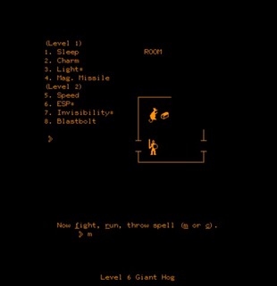

+++
title = 'cprg archaeology'
date = 2025-03-04T11:29:16Z
draft = true
+++

lately I've been retreating into the past, at least partially, right?

somehow, perhaps because I started playing some gamebooks and such, I wanted to recover the Dark Heart of Uukrul copy I had for macOS (using DosBox). in the process, I ended up recreating bundles myself, and choosing the best settings I could. and this took me into a couple of blogs, [The CRPG Bool Project]](https://crpgbook.wordpress.com/), the Vogons forum, and the work of retrogaming and emulation.

at the same time, the first week of this year (2025) I discovered the LCD handheld game of DND via a multiarcade emulator machine during Epiphany's Eve (or Three Kings Day's Eve, I guess) within a venue hired so that my niece and her friends could have some fun together before settling for the night (and the excitement of the next day). Also to give the parents some respite.

anyway. I played some handled electronic games when I was a kid, but didn't remember that one, and didn't (still don't) have a clue of how to play it. but it picked my attention and so I search for it as this was evidently something I should be able to run on a Raspberry Pi or macOS. and then I found the primordial soup of CPRGs, the Plato mainframe and the games that appeared there. lots of them called DND in different variations.

so, my interest swifted then to play the oldest preserved CRPGs. after some additional investigation and determining that it wouldn't be possible playing any of them locally (they were created on the mainframe system, coded in TUTOR, and the code is not public), I played aropund a bit with a demo account (you can also do that) while waiting for a signon, read about their history and their chronology.

`pedit` (the Dungon) is the oldest preserved game (at least that is clear to me). some games might have started earlier (but were not playable until later) and some users of Plato seem to recall either previous versions of `The Dungon` or some other programs for which there are no copies. the timeline is a bit murky and there is `m119h` or "Dungeon" (but [some recent data](https://crpgaddict.blogspot.com/2023/10/m199h-new-findings-both-solve-and.html) points to it being a remake or a recovered version of `pedit5`, as it was frequenly deleted).

`dnd` was inspired by `pedit5` ("The Dungeon"), but `pedit5` started because there was work ongoing on `dnd` (all of this after the 1st edition of Dungeons and Dragons was published in 1974 and people started playing table top RPGs). a long time has passed and the names were pretty similar (Dungeon, The dungeon, etc...) so confussion is unavoidable.

after some initial frustration and not really understanding the mechanics, I decided to read a bit and give it a try later.

In the meantime restarted an Eye of the Beholder gameplay (I played in the past, had a DOSBox version, the GOG version and, now, my bundle), putting some thought into the creation of my party and choosing a cartography/map creation application instead of relying on a paper version like in the past. I found the free and terribly good Gridmonger (for which there are already some EOB maps available). entirely my jam, mostly driven via the keyboard. it takes some time getting used to it (like everything) but being able to compare with an already complete map helps a lot. I got to level 2, progressed a bit, and then remembered that the previous morning I had received my signon information for Cyber1.

having a bit of a lazy week (the beginning of 2025 has been like that), I plugged the macbook onto the TV, fired up Gridmonger and Pterm, kept the [Pterm keyboard reference](https://www.cyber1.org/keyboard.asp) at hand, and started:

* rerolling characters until getting a nice set of statistics
* mapping some of the level
* dying unexpectedly due to a misguided reliance on physical attacks

then read some accounts of other gameplays, some strategy (very simple to be honest), reread the help/history provided by the game (everything you need to know is there) and gave it another try after dinner (and watching some Star Trek Voyager, which I've been feeding from after re-watching in one go the magnificent Star Trek The Lower Decks ).

[about those old games](https://crpgaddict.blogspot.com/2021/06/brief-everything-we-know-about-1970s.html)